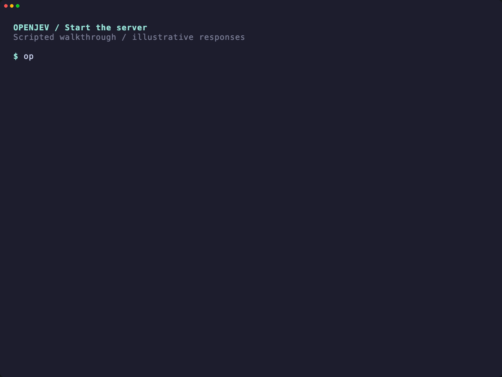

<a id="readme-top"></a>

# openjev-rs

<a href="docs/demo.md"></a>

**Local typed decisions for scripts, applications, and AI agents.**

Run `openjev` once from the command line, or start `openjev serve` to keep a
model loaded behind a Jev-compatible HTTP API. Both return JSON—no generated
prose to parse, and no hosted inference service required.

[Download a release](https://github.com/codesoda/openjev-rs/releases)
· [HTTP API documentation](docs/SERVE.md)
· [Report a bug](https://github.com/codesoda/openjev-rs/issues)
· [Request a feature](https://github.com/codesoda/openjev-rs/issues/new)

## Table of contents

- [About the project](#about-the-project)
  - [Built with](#built-with)
- [Getting started](#getting-started)
  - [Prerequisites](#prerequisites)
  - [Install the CLI](#install-the-cli)
  - [Download a model](#download-a-model)
  - [Build from source](#build-from-source)
- [Usage](#usage)
  - [One-shot CLI](#one-shot-cli)
  - [JSON and batch input](#json-and-batch-input)
  - [Jev-compatible HTTP server](#jev-compatible-http-server)
  - [Use the TypeSafe JavaScript SDK](#use-the-typesafe-javascript-sdk)
- [Models](#models)
- [Limitations](#limitations)
- [Documentation](#documentation)
- [Roadmap](#roadmap)
- [Contributing](#contributing)
- [License](#license)
- [Contact](#contact)
- [Acknowledgments](#acknowledgments)

## About the project

OpenJev reads the next-token option logits from a frozen open language model
using llama.cpp. It scores the supplied alternatives without generating an
answer or chain of thought.

| Decision | Use it for | Result |
| --- | --- | --- |
| **Choice** | Routing a ticket or selecting a candidate | Selected option and probabilities |
| **Noul** | A yes/no question | Probability assigned to yes |
| **Score** | Rating against ordered levels | Probability-weighted expected value |

Use the **CLI** for shell pipelines and one-off decisions. Use the **HTTP
server** for repeated calls from applications or agents: it loads and warms one
model once, then accepts requests through a bounded in-memory queue.

This is an independent implementation inspired by [SemIf / openjev](https://github.com/TheoLeeCJ/openjev).
It is not affiliated with or endorsed by TypeSafe AI or SemIf. Jev compatibility
means the documented wire/API subset—not identical models, answers, or confidence.

### Built with

- [Rust](https://www.rust-lang.org/)
- [llama.cpp](https://github.com/ggml-org/llama.cpp) through [llama-cpp-2](https://github.com/utilityai/llama-cpp-rs)
- [Hugging Face Hub](https://huggingface.co/) for pinned, checksum-verified GGUF weights
- [Axum](https://github.com/tokio-rs/axum) and [Tokio](https://tokio.rs/) for HTTP serving

## Getting started

### Prerequisites

For a prebuilt binary, **no Rust, Python, compiler, or Xcode installation is
needed**.

| Release target | Requirements |
| --- | --- |
| Apple Silicon macOS | macOS 14 or newer; Metal acceleration included |
| Linux x86-64 | glibc 2.35 or newer; system `libstdc++` and `libgcc`; CPU inference |

You need internet access for the initial binary/model download and enough disk
space for your chosen model. Model weights are not included in the binary archive.
The macOS binary is not Developer ID signed or notarized.

### Install the CLI

The installer downloads a prebuilt release, verifies its SHA-256 checksum, and
installs it without `sudo`. No GitHub account, token, or GitHub CLI is needed:

```sh
curl -fsSL https://raw.githubusercontent.com/codesoda/openjev-rs/main/install.sh | sh
```

The installer downloads the latest public release directly with `curl`. To pin a
version:

```sh
curl -fsSL https://raw.githubusercontent.com/codesoda/openjev-rs/main/install.sh | sh -s -- --version v0.2.0
```

From a local checkout, `sh install.sh` performs the same prebuilt installation—it
does not compile the project.

- Versioned binaries and their license notices live under `~/.openjev/bin/`.
- `~/.openjev/bin/openjev` selects the installed version.
- `~/.local/bin/openjev` links to `~/.openjev/bin/openjev`.
- On macOS, the installer clears `com.apple.quarantine` when present using
  `xattr -d` on the verified executable before checking that it runs. It does not change global
  Gatekeeper settings.

Rerun the installer to upgrade; previous versioned payloads are retained. Unrelated
existing files or symlinks are not overwritten. No shell startup file is edited.
If `~/.local/bin` is not already on your PATH, add this to your shell configuration:

```sh
export PATH="$HOME/.local/bin:$PATH"
openjev --version
```

See [the installer source](install.sh) before running it, or use the
[manual installation instructions](docs/RELEASE.md). Model downloads are separate.

### Download a model

Start with the smallest model to try the CLI:

```sh
openjev models pull qwen3-0.6b
```

Downloads are pinned and verified by size and SHA-256. The default cache is
`~/.cache/openjev`; change it with `--cache-dir PATH` or `OPENJEV_HOME`.
Once the model is cached, `--offline` prevents model downloads.

### Build from source

<details>
<summary>Optional: build a native CLI instead of downloading a release</summary>

Requires Rust 1.95+, CMake, and a C/C++ toolchain with clang/libclang. On macOS,
install Xcode Command Line Tools and CMake. On Ubuntu, the native prerequisites
include `build-essential clang libclang-dev cmake pkg-config`.

```sh
git clone https://github.com/codesoda/openjev-rs.git
cd openjev-rs

# Apple Silicon: Metal acceleration, with the Metal library embedded.
GGML_METAL=ON GGML_METAL_EMBED_LIBRARY=ON CARGO_TARGET_DIR=target-m2-metal \
  cargo build --locked --release -p openjev-cli --features metal

# Alternatively, a CPU-only build on Linux or macOS.
GGML_METAL=OFF CARGO_TARGET_DIR=target-m2-cpu \
  cargo build --locked --release -p openjev-cli --features native
```

Run `target-m2-metal/release/openjev` or `target-m2-cpu/release/openjev` directly,
or install your chosen executable on PATH. Keep CPU and Metal builds in separate
target directories. Plain `cargo build` deliberately omits the native backend:
help and validation work, but inference returns `backend_unavailable`.

</details>

## Usage

### One-shot CLI

These examples use the model downloaded above. A one-shot invocation loads the
model and exits after returning its result. For repeated calls, use
[`serve`](#jev-compatible-http-server) instead.

**Choose an option:**

```sh
openjev --offline --model qwen3-0.6b --compact --quiet --pretty decide \
  --state 'The customer was charged twice for their subscription.' \
  --question 'Which team should handle this ticket?' \
  --option Billing --option Support --option Sales
```

**Ask a yes/no question, with state piped from stdin:**

```sh
printf '%s' 'The customer explicitly asks for a refund.' | \
  openjev --offline --model qwen3-0.6b --compact --quiet noul \
    --question 'Does the customer request a refund?'
```

**Score against named levels and numeric values:**

```sh
openjev --offline --model qwen3-0.6b --compact --quiet --pretty score \
  --state-json '{"incident":"Checkout is unavailable","severity":3}' \
  --question 'How urgent is this incident?' \
  --level low --level medium --level high \
  --level-value 0 --level-value 5 --level-value 10
```

| Option | Purpose |
| --- | --- |
| `--compact` | Smaller decision JSON for code or an LLM; omits full model/runtime diagnostics |
| `--pretty` | Indented JSON for a single result (or the demo's result array); not supported for decision JSONL or multiple questions |
| `--quiet` | Suppress routine logs; warnings and errors remain on stderr |
| `--confidence` | Include the explicitly uncalibrated confidence value |
| `--state-file PATH` | Read state as text from a file |
| `--state-json-file PATH` | Read structured JSON state from a file |
| `--device metal` / `--device cpu` | Explicitly select a backend supported by your build |

Supply exactly one state source, or pipe text through stdin. Text is not guessed
as JSON: use `--state-json` or `--state-json-file` for structured input.
**stdout is JSON/JSONL only; diagnostics go to stderr.** Full diagnostic readouts
are the default; compact CLI output is an OpenJev schema, not the Jev HTTP schema.
See [Compact output](docs/COMPACT.md) for its fields.

Help is also a JSON object. To display its human-readable text with optional
[`jq`](https://jqlang.github.io/jq/):

```sh
openjev --help | jq -r .text
openjev decide --help | jq -r .text
```

### JSON and batch input

Use `ask` for one complete decision object:

```sh
printf '%s\n' \
  '{"id":"ticket-1","state":"I was charged twice.","question":"Which queue?","options":[{"id":"billing","description":"Payments and invoices"},{"id":"support","description":"Product support"}]}' \
  | openjev --offline --model qwen3-0.6b --compact --quiet ask
```

Use `run` for a JSONL file containing one such object per line:

```sh
openjev --offline --model qwen3-0.6b --compact --quiet run \
  --input decisions.jsonl --output results.jsonl
```

The output file must not already exist. Omit `--output` to stream JSONL to
stdout. Rows preserve input order; per-row inference errors are emitted and
processing continues. Exit codes: **0** success, **1** runtime failure (including
any failed batch row), **2** invalid arguments/input. `--pretty` is not valid for
`run`.

### Jev-compatible HTTP server

Start a resident server with the cached model:

Since v0.2.0, use the `serve` subcommand (no `--serve` alias). If upgrading from
v0.1.0, replace `openjev --serve` with `openjev serve`.

```sh
openjev serve --offline --model qwen3-0.6b \
  --host 127.0.0.1 --port 8080
```

The model is loaded and warmed once. The default address is
`http://127.0.0.1:8080`. Leave this process running and send requests from another
terminal.

**Try eight examples:**

```sh
# Terminal 2 — leave the server running in Terminal 1
openjev demo --pretty
```

The demo sends eight sequential `POST /v1/systemone` requests: support routing,
agent tool selection, message intent, refund detection, missing information,
incident urgency, evidence sufficiency, and mixed Choice/Noul/Score triage.
It uses the server's resident model, **without loading or downloading another
model**. These illustrate the API; they are not accuracy tests.

Progress, states, and questions go to stderr. stdout contains results with
`example`, the exact `request` (state, questions, and options), `elapsed_ms`
(HTTP round-trip time, including queueing), the unchanged Jev `response`, and
`metadata` preserving execution/fallback/probability headers.
By default results stream as JSONL; `--pretty` emits one JSON array after all
examples succeed. Use `--quiet` to suppress progress. A failed example stops the
run with a nonzero exit code; JSONL results already written remain available.

```sh
# Custom port; omit --api-key-env for an unauthenticated loopback server
openjev demo --base-url http://127.0.0.1:9090 --api-key-env OPENJEV_API_KEY
# /v1 is also accepted; per-request timeout defaults to 130 seconds
openjev demo --base-url http://127.0.0.1:8080/v1 --timeout-secs 180
```

`--model` optionally names the model expected on the server; it does not load or
switch models. The demo is available from v0.2.0. Run the server and demo in
separate terminals, not with `&&`: the server
stays in the foreground until stopped.

**Or call the API directly:**

```sh
curl --fail-with-body --silent --show-error http://127.0.0.1:8080/readyz

curl --fail-with-body --silent --show-error \
  http://127.0.0.1:8080/v1/systemone \
  -H 'Content-Type: application/json' \
  --data-binary '{
    "model": "jev-latest",
    "state": {"ticket": "duplicate charge", "severity": 3},
    "questions": {
      "route": {
        "type": "choice",
        "instructions": "Which team should handle this?",
        "criteria": {"billing": "Payments and invoices", "support": "Product support"}
      },
      "review": {
        "type": "noul",
        "instructions": "Does a human need to review this?"
      },
      "urgency": {
        "type": "score",
        "instructions": "How urgent is this?",
        "criteria": ["low", "medium", "high"]
      }
    }
  }'
```

Response shape (**illustrative values**, not a promised prediction):

```json
{
  "model": "qwen3-0.6b",
  "answers": {
    "route": {
      "type": "choice",
      "choice": "billing",
      "confidence": 0.8,
      "probabilities": {"billing": 0.9, "support": 0.1}
    },
    "review": {"type": "noul", "noul": 0.75},
    "urgency": {
      "type": "score",
      "score": 1.2,
      "confidence": 0.25,
      "legend": {"0": "low", "1": "medium", "2": "high"},
      "probabilities": {"0": 0.15, "1": 0.5, "2": 0.35}
    }
  },
  "usage": {"input_tokens": 313, "output_tokens": 0}
}
```

`jev-latest` is an accepted alias for the **locally loaded model**, not a call to
hosted Jev. The response reports that model's actual identity. HTTP Score uses
the expected zero-based level index; it does not accept the CLI's custom level
values. `output_tokens` is zero because there is no generation.

| Endpoint | Purpose |
| --- | --- |
| `POST /v1/systemone` | Evaluate typed questions against a state |
| `GET /v1/models` | List the one resident model |
| `GET /healthz` | Health check |
| `GET /readyz` | Readiness check |

**Serving behavior:** up to 16 requests are admitted across body reading,
queuing, and inference. One inference worker processes jobs sequentially;
HTTP handlers await replies asynchronously. The queue is in memory, not
persistent. The default 120-second deadline includes queue time; overload
returns HTTP 429. Stop the server with Ctrl+C or SIGTERM. Native inference
cannot be interrupted mid-decode.

**Network access:** loopback needs no API key. Binding outside loopback requires
a bearer secret; terminate TLS at a trusted reverse proxy rather than exposing
unencrypted HTTP publicly.

```sh
export OPENJEV_API_KEY='replace-with-a-long-random-secret'
openjev serve --offline --model qwen3-0.6b \
  --host 0.0.0.0 --port 8080 --api-key-env OPENJEV_API_KEY
```

Clients must then send `Authorization: Bearer <your-secret>` to inference and
model routes. See [HTTP API documentation](docs/SERVE.md) for all limits,
errors, auth behavior, and cancellation details.

### Use the TypeSafe JavaScript SDK

The supported subset has been smoke-tested with `@typesafe-ai/sdk` **0.6.0**.
In a Node.js project:

```sh
npm install @typesafe-ai/sdk@0.6.0
```

Save as `example.mjs` and run with `node example.mjs` while the server is running:

```js
import { TypeSafeClient, choice, noul, score } from "@typesafe-ai/sdk";

const client = new TypeSafeClient({
  apiKey: process.env.OPENJEV_API_KEY || "local-dummy-token",
  baseURL: "http://127.0.0.1:8080",
  timeout: 120_000,
  retry: { maxRetries: 0 },
});

const result = await client.systemOne({
  model: "jev-latest",
  state: { ticket: "The customer was charged twice." },
  questions: {
    route: choice("Which team?", { billing: "Payments", support: "Product support" }),
    review: noul("Does a human need to review this?"),
    urgency: score("How urgent?", ["low", "medium", "high"]),
  },
});

console.log(JSON.stringify(result, null, 2));
```

**Use the server root as `baseURL`, without `/v1`.** This SDK appends the API
path itself. Use a dummy key only for an unauthenticated loopback server;
otherwise pass the configured secret. Request/response compatibility does not
imply the same predictions as hosted Jev.

## Models

| Model ID | Quantization | Approx. download | When to try it |
| --- | --- | --- | --- |
| `qwen3-0.6b` | Q8_0 | 0.64 GB | Smallest download; quick local experiments |
| `minicpm5-2b` | Q4_K_M | 1.56 GB | Middle size; default when `--model` is omitted |
| `qwen3.5-4b` | Q4_K_M | 3.01 GB | Strongest results on our recorded decision fixtures; slower |

Download size is not runtime memory usage. To use the larger model:

```sh
openjev models pull qwen3.5-4b
openjev serve --offline --model qwen3.5-4b
```

Stop an existing server on the same port first. Models and native settings are
selected at startup; restart to change them. Inspect available/cached models:

```sh
openjev models list
openjev --offline models path qwen3-0.6b
```

See [recorded evaluation and benchmark results](docs/PROGRESS.md#m6--bounded-measurement-checkpoint-and-handoff-status)
and [runtime evidence](docs/RESULTS.md). Fixture scores are not guarantees on
your application's data.

## Limitations

- **Typed output can still be wrong.** Probabilities are conditional on the
  supplied alternatives and are not calibrated operational confidence.
- **Shared execution currently falls back to serial on tested profiles.**
  Weights remain loaded in server mode, but questions reprocess their full
  prompts. Fallback is disclosed in HTTP headers/CLI metadata and stderr.
  `--require-shared` rejects requests that cannot use an eligible shared path.
- **This is a supported Jev API subset, not a universal drop-in replacement.**
  HTTP accepts at most 64 questions; Choice has 1–16 options, Score 2–16 levels.
  Request bodies are limited to 1 MiB. Duplicate JSON keys and floating-point
  input numbers are rejected; integer values are supported. Full rules are in
  [SERVE.md](docs/SERVE.md) and the [HTTP schema](schemas/jev-http-v1.schema.json).
- **Validation coverage differs by platform.** The downloaded macOS release
  passed real Metal HTTP/SDK smoke tests. Linux release CI checked builds,
  tests, packaging, and linkage—not model inference. No HTTP load-performance
  guarantee is claimed.
- **Some advertised CLI surfaces are still planned.** Calibration, permutation
  averaging, and nondefault temperature settings are not implemented. Eval and
  bench exist, but the full benchmark milestone remains incomplete.

## Documentation

| Document | Contents |
| --- | --- |
| [HTTP API](docs/SERVE.md) | Wire semantics, limits, authentication, lifecycle, SDK compatibility |
| [Binary releases](docs/RELEASE.md) | Platforms, checksum verification, package contents |
| [Compact output](docs/COMPACT.md) | Small CLI response format for scripts and LLMs |
| [JSON schemas](schemas/) | CLI readouts, compact output, HTTP requests/responses |
| [Results](docs/RESULTS.md) | Parity, runtime checks, and release acceptance evidence |
| [Progress](docs/PROGRESS.md) | Measured benchmarks and implementation history |
| [Plan](docs/PLAN.md) / [brief](todo.md) | Architecture, requirements, and remaining work |

## Roadmap

- [x] Typed CLI decisions with pinned, verified GGUF models.
- [x] Apple Silicon Metal and Linux CPU release binaries.
- [x] Resident Jev-compatible HTTP subset and official SDK smoke tests.
- [x] Compact JSON output and eval/bench commands.
- [ ] Complete the evaluation and CPU/Metal benchmark matrix.
- [ ] Enable shared/batched execution only after its correctness gates pass.
- [ ] Add permutation averaging and temperature calibration.
- [ ] Broaden real-model platform and concurrent HTTP validation.

See [open issues](https://github.com/codesoda/openjev-rs/issues) and
[the implementation brief](todo.md) for details.

## Contributing

Open an issue to discuss significant changes, then submit a focused pull request
with tests. From a source checkout, run:

```sh
cargo fmt --all -- --check
cargo clippy --workspace --all-targets -- -D warnings
cargo test --workspace
```

Ordinary tests do not download or load models. Native model integration tests
are opt-in with the `integration` feature and `OPENJEV_INTEGRATION=1`; consult
the [plan](docs/PLAN.md) and [results](docs/RESULTS.md) before running them.
Keep CLI stdout machine-readable, preserve pinned reference semantics, and do
not weaken parity gates to enable an optimization.

## License

Project code is distributed under the **MIT License**. See [LICENSE](LICENSE).
Model weights have their own terms. Third-party dependencies, upstream credits,
and the notices shipped with binaries are documented in [THIRD_PARTY.md](THIRD_PARTY.md)
and [the release guide](docs/RELEASE.md).

## Contact

Project: [codesoda/openjev-rs](https://github.com/codesoda/openjev-rs)

For bugs, questions, and feature requests, use
[GitHub Issues](https://github.com/codesoda/openjev-rs/issues).

## Acknowledgments

- [TheoLeeCJ / SemIf](https://github.com/TheoLeeCJ/openjev) for the upstream
  decision-readout approach, Python reference, and evaluation fixtures.
- [llama.cpp](https://github.com/ggml-org/llama.cpp) and
  [llama-cpp-rs](https://github.com/utilityai/llama-cpp-rs) for local inference.
- The Qwen and MiniCPM teams, and the GGUF publishers listed in
  [the model manifest](manifests/models.json).
- [Best-README-Template](https://github.com/othneildrew/Best-README-Template)
  for the organization of this README.

[Back to top](#readme-top)
