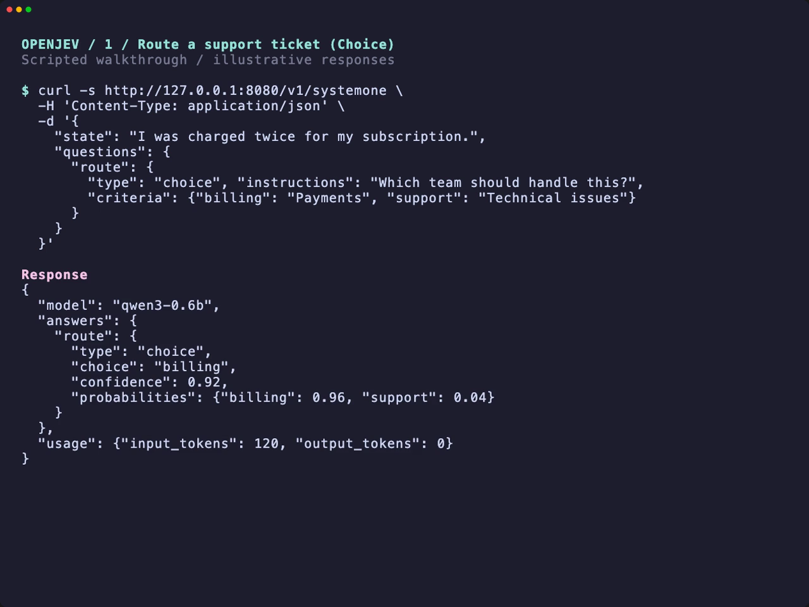

# OpenJev demo

[](demo.mp4)

**[▶ Open the video](demo.mp4)** — GitHub Markdown does not support inline
playback of repository MP4s.

This is a **scripted walkthrough with illustrative responses**, not a live
recording or a performance/accuracy benchmark. The curl commands below are real
API examples you can copy; predictions, probabilities, token counts, and startup
time will vary with your model and machine.

## Start the server

```sh
# First time only: download the model
openjev models pull qwen3-0.6b

# Leave this running in its own terminal
openjev serve --model qwen3-0.6b
```

The server loads the model once and listens at `http://127.0.0.1:8080`.
Run the following requests in a second terminal. These commands require the
v0.2.0 or newer with the `serve` subcommand; v0.1.0 uses `--serve`.

## 1. Route a support ticket — Choice

**Input:** a customer says they were charged twice. Supply two possible teams,
with descriptions explaining what each handles.

```sh
curl -s http://127.0.0.1:8080/v1/systemone \
  -H 'Content-Type: application/json' \
  -d '{
    "state": "I was charged twice for my subscription.",
    "questions": {
      "route": {
        "type": "choice", "instructions": "Which team should handle this?",
        "criteria": {"billing": "Payments", "support": "Technical issues"}
      }
    }
  }'
```

**Result:** `answers.route.choice` identifies the selected team. The video shows
`billing`, along with the conditional option probabilities and confidence.
These scores are uncalibrated; a typed answer can still be wrong.

## 2. Detect a refund request — Noul

**Input:** a customer asks for their payment back after a missing delivery.
Ask a yes/no question without supplying a list of options.

```sh
curl -s http://127.0.0.1:8080/v1/systemone \
  -H 'Content-Type: application/json' \
  -d '{
    "state": "The parcel never arrived. Please refund my payment.",
    "questions": {
      "refund": {
        "type": "noul", "instructions": "Does the customer request a refund?"
      }
    }
  }'
```

**Result:** `answers.refund.noul` is the probability assigned to yes, rather than
a boolean or generated explanation. The illustrative value `0.97` indicates
strong preference for yes—not a calibrated guarantee of correctness.

Both responses include the resident model identity and token usage.
`output_tokens` is zero because OpenJev reads option logits rather than generating
text. Append `| jq` to either curl command for pretty JSON, if jq is installed.
The walkthrough formats response JSON for readability.

## More examples

```sh
openjev demo --pretty
```

Runs eight real HTTP examples against the resident server, including Choice,
Noul, ordered-level Score, and a mixed-question request.

[HTTP API reference](SERVE.md) · [Recording source and VHS instructions](../demo/README.md)
